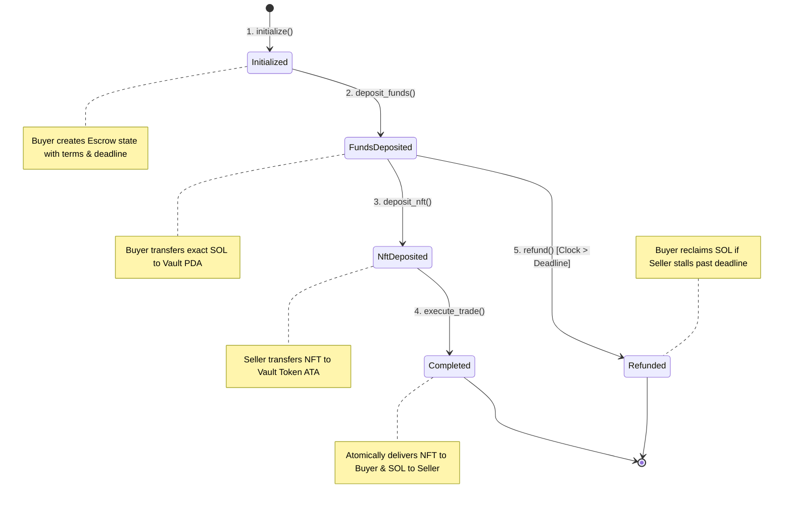

<div align="center">

# ⚡ LetsDeal Protocol
### *Deterministic, Trustless P2P Escrow for Atomic SOL ⇄ NFT Swaps on Solana*

[](https://explorer.solana.com/address/FzwhoLmFm8avMRpgwTL5mWiC8oi8RSqkbDdYBU7SeQj?cluster=devnet)
[](https://www.anchor-lang.com/)
[](./letsdeal-frontend)
[](https://txtx.sh)
[](https://github.com/sahkunal/lets_deal/tree/dev)
[](./LICENSE)

<p align="center">
  <b>Eliminate counterparty risk. Replace trust with immutable on-chain state machines.</b>
</p>

---

[Overview](#-overview) •
[Architecture & PDAs](#-architecture--pda-design) •
[State Machine](#-state-machine-lifecycle) •
[Instructions Deep Dive](#-instruction-specifications) •
[Account Layouts](#-account-structures--memory-layout) •
[Frontend dApp](#-frontend-client-architecture) •
[Testing & Simulation](#-testing--simulation) •
[Deployment (Anchor & Txtx)](#-deployment--on-chain-artifacts) •
[Git & Branching Workflow](#-git--branching-workflow) •
[Developer Quickstart](#-developer-quickstart)

---

</div>

## 🌐 Overview

**LetsDeal** is a peer-to-peer, non-custodial escrow protocol native to the Solana blockchain. It enables trust-minimized atomic trades between a **Buyer** (depositing SOL) and a **Seller** (depositing an SPL-compliant NFT or semi-fungible token).

Traditional OTC (over-the-counter) Web3 trades require a trusted third-party intermediary, Discord middleman, or blind trust. LetsDeal mathematically eliminates fraud and counterparty risk:

1. **Non-Custodial Escrow**: Locked assets are owned and controlled strictly by **Program Derived Addresses (PDAs)** governed by open-source smart contract code, never by an admin or private key.
2. **Deterministic Settlement**: The swap executes atomically if and only if both the buyer's SOL and the seller's NFT are safely secured in the program vault.
3. **Automated Refund Guarantee**: If the seller fails or refuses to deposit the NFT before a predetermined unix timestamp deadline, the buyer can unilaterally claim a 100% refund of their locked SOL.

```
                  ┌────────────────────────────────────────┐
                  │          LETSDEAL PROGRAM (PDA)        │
                  │                                        │
[ Buyer ] ──(1) Deposit SOL ──► [ Vault PDA ] ◄──(2) Deposit NFT ── [ Seller ]
    │                               │                                    │
    │                               │                                    │
    │                    ┌──────────┴──────────┐                         │
    │                    │                     │                         │
    │           [ Both Deposited ]      [ Deadline Passed ]              │
    │                    │                     │                         │
    │                    ▼                     ▼                         │
    ▼             Execute Trade           Refund SOL                     ▼
(Receives NFT) ◄───────────────────────────────────────────────► (Receives SOL)
```

---

## 🏗️ Architecture & PDA Design

The protocol is built using the **Anchor Framework (v1.0.2)** on Solana. It separates trade metadata from asset custody using deterministic Program Derived Addresses.

```
                      +-----------------------------+
                      |     Escrow State Account    |
                      |   (Unique Keypair Account)  |
                      | - buyer, seller, amount     |
                      | - deadline, nft_mint, state |
                      +--------------+--------------+
                                     |
                         seeds = [b"vault", escrow.key()]
                                     |
                                     v
                      +-----------------------------+
                      |          Vault PDA          |
                      |    (Program-Derived Auth)   |
                      +--------------+--------------+
                                     |
                   +-----------------+-----------------+
                   |                                   |
                   v                                   v
        +---------------------+             +---------------------+
        |  Vault SOL Balance  |             |  Vault NFT Account  |
        |  (Native Lamports)  |             |  (SPL Token ATA)    |
        +---------------------+             +---------------------+
```

### 1. Program Derived Address (PDA) Seeds
The vault holding escrow assets is derived from the constant seed `"vault"` concatenated with the public key of the specific `Escrow` state account:

$$\text{Vault PDA} = \text{find\_program\_address}\Big(\big[\texttt{"vault"},\; \text{EscrowPubkey}\big],\; \text{ProgramId}\Big)$$

- **No Private Key Exists**: Only the `lets_deal` program can sign for instructions originating from this address via `invoke_signed`.
- **Unique Per Escrow**: Every trade instance gets an isolated vault address, ensuring complete fault isolation across multiple simultaneous trades.
- **Off-Curve ATA Compatibility**: When creating the vault's Associated Token Account for the NFT, `allowOwnerOffCurve: true` is utilized.

---

## 🔄 State Machine Lifecycle

Every trade transitions through an explicit, strictly enforced state machine defined in [`programs/lets_deal/src/state/escrow.rs`](file:///c:/Users/arpit/lets_deal/programs/lets_deal/src/state/escrow.rs):



### State Definitions

| State Name | Value | Description | Permitted Next Actions |
| :--- | :---: | :--- | :--- |
| `Initialized` | `0` | Escrow account initialized with buyer, seller, price, NFT mint, and deadline. | `deposit_funds` |
| `FundsDeposited` | `1` | Buyer's SOL is locked safely inside the Vault PDA. | `deposit_nft`, `refund` (post-deadline) |
| `NftDeposited` | `2` | Seller's NFT is deposited into the Vault's Associated Token Account. | `execute_trade` |
| `Completed` | `3` | Trade executed: NFT transferred to Buyer, SOL transferred to Seller. | Terminal State |
| `Refunded` | `4` | Deadline elapsed without NFT deposit: Vault lamports returned to Buyer. | Terminal State |

---

## ⚙️ Instruction Specifications

The smart contract exposes 5 distinct instructions. Below are their complete account requirements, constraints, and operational logic:

### 1. `initialize`
Creates and initializes the `Escrow` state account on-chain.
- **Parameters**: `amount: u64` (in lamports), `deadline: i64` (unix timestamp), `nft_mint: Pubkey`.
- **Validation**:
  - `amount > 0` $\rightarrow$ throws `ErrorCode::InvalidAmount`
  - `deadline > Clock::get()?.unix_timestamp` $\rightarrow$ throws `ErrorCode::InvalidDeadline`

```rust
pub struct Initialize<'info> {
    #[account(init, payer = buyer, space = Escrow::LEN)]
    pub escrow: Account<'info, Escrow>,
    #[account(mut, seeds = [b"vault", escrow.key().as_ref()], bump)]
    pub vault: UncheckedAccount<'info>,
    #[account(mut)]
    pub buyer: Signer<'info>,
    pub seller: UncheckedAccount<'info>,
    pub system_program: Program<'info, System>,
}
```

---

### 2. `deposit_funds`
Transfers the stipulated SOL amount from the buyer's wallet into the Vault PDA via Solana System Program CPI.
- **Preconditions**:
  - `escrow.state == EscrowState::Initialized`
  - `buyer.key() == escrow.buyer`
- **Effect**: Moves `escrow.amount` lamports into the vault, updates state to `FundsDeposited`.

---

### 3. `deposit_nft`
Transfers 1 token of `nft_mint` from the seller's ATA into the vault's ATA via SPL Token CPI.
- **Preconditions**:
  - `escrow.state == EscrowState::FundsDeposited`
  - `seller.key() == escrow.seller`
- **Effect**: Transfers 1 token from `seller_nft_account` to `vault_nft_account`, updates state to `NftDeposited`.

---

### 4. `execute_trade`
Atomically completes the bilateral swap using PDA signing seeds (`invoke_signed` and `CpiContext::new_with_signer`).
- **Preconditions**:
  - `escrow.state == EscrowState::NftDeposited`
  - `seller.key() == escrow.seller`
- **Atomic Operations**:
  1. Transfers NFT from `vault_nft_account` $\rightarrow$ `buyer_nft_account` (Authority: `vault` PDA).
  2. Transfers `escrow.amount` SOL from `vault` $\rightarrow$ `seller` (Authority: `vault` PDA).
  3. Updates state to `Completed`.

---

### 5. `refund`
Allows the buyer to reclaim their deposited SOL if the trade deadline expires before completion.
- **Preconditions**:
  - `Clock::get()?.unix_timestamp > escrow.deadline` $\rightarrow$ throws `ErrorCode::TooEarly`
- **Effect**: Empties all lamports from `vault` to `buyer` via `invoke_signed`, updates state to `Refunded`.

---

## 📦 Account Structures & Memory Layout

The escrow state account has a strictly bounded byte size of **113 bytes**:

```rust
#[account]
pub struct Escrow {
    pub buyer: Pubkey,     // 32 bytes
    pub seller: Pubkey,    // 32 bytes
    pub amount: u64,       // 8 bytes
    pub deadline: i64,     // 8 bytes
    pub nft_mint: Pubkey,  // 32 bytes
    pub state: EscrowState // 1 byte
}
```

### Memory Space Calculation

| Component | Field | Size (Bytes) | Offset (Hex) |
| :--- | :--- | :---: | :---: |
| **Discriminator** | `anchor_discriminator` | `8` | `0x00 - 0x07` |
| **Buyer Pubkey** | `escrow.buyer` | `32` | `0x08 - 0x27` |
| **Seller Pubkey** | `escrow.seller` | `32` | `0x28 - 0x47` |
| **Amount (SOL)** | `escrow.amount` | `8` | `0x48 - 0x4F` |
| **Deadline Timestamp** | `escrow.deadline` | `8` | `0x50 - 0x57` |
| **NFT Mint Pubkey** | `escrow.nft_mint` | `32` | `0x58 - 0x77` |
| **Escrow State** | `escrow.state` | `1` | `0x78` |
| **Total Account Size** | `Escrow::LEN` | **`113` bytes** | — |

---

## 🛡️ Error Codes Reference

Custom program errors are declared in [`programs/lets_deal/src/errors.rs`](file:///c:/Users/arpit/lets_deal/programs/lets_deal/src/errors.rs):

| Error Code | Error Name | Hex / Anchor ID | Reason & Resolution |
| :---: | :--- | :---: | :--- |
| `6000` | `InvalidState` | `0x1770` | Attempted an instruction not allowed in the current escrow state (e.g. depositing funds when already deposited). |
| `6001` | `Unauthorized` | `0x1771` | Signer does not match the buyer or seller recorded in the escrow state. |
| `6002` | `InvalidAmount` | `0x1772` | Escrow amount specified during `initialize` was 0. Must be $> 0$ lamports. |
| `6003` | `InvalidDeadline` | `0x1773` | Specified deadline is in the past. Must be a future unix timestamp. |
| `6004` | `TooEarly` | `0x1774` | Attempted to call `refund()` before the unix timestamp deadline had expired. |

---

## 🗂️ Codebase Architecture

```text
lets_deal/
├── programs/
│   └── lets_deal/
│       ├── Cargo.toml                   → Anchor program manifest
│       └── src/
│           ├── lib.rs                   → Program entrypoint & module routing
│           ├── constants.rs             → PDA seed constants ("escrow", "vault")
│           ├── errors.rs                → Custom Anchor error codes
│           ├── state/
│           │   ├── mod.rs
│           │   └── escrow.rs            → Escrow account layout (113 bytes) & State enum
│           └── instructions/
│               ├── mod.rs
│               ├── initialize.rs        → Initialize escrow terms
│               ├── deposit_funds.rs     → Lock SOL in vault PDA
│               ├── deposit_nft.rs       → Lock SPL NFT in vault ATA
│               ├── execute_trade.rs     → Atomic settlement with PDA signer seeds
│               └── refund.rs            → Timeout refund handler
│
├── letsdeal-frontend/                   → Cyberpunk terminal styled Web3 dApp
│   ├── package.json                     → React 18, Vite, @solana/web3.js, Wallet-Adapter
│   ├── vite.config.ts                   → Build config
│   ├── src/
│   │   ├── App.tsx                      → HashRouter & Route mapping
│   │   ├── constants.ts                 → Program ID & explorer helpers
│   │   ├── lib/
│   │   │   ├── discriminator.ts         → Standalone sha256 8-byte discriminator generator
│   │   │   ├── escrowAccount.ts         → Manual Borsh parser (Zero IDL coupling)
│   │   │   ├── instructions.ts          → Low-level transaction instruction builders
│   │   │   ├── pda.ts                   → Deterministic Vault PDA resolver
│   │   │   └── ata.ts                   → Associated Token Account resolver
│   │   ├── hooks/
│   │   │   ├── useEscrow.ts             → Real-time polling & decoding hook
│   │   │   └── useCountdown.ts          → Live deadline countdown timer
│   │   ├── components/
│   │   │   ├── ActionCard.tsx           → Interaction controls
│   │   │   ├── Header.tsx               → Cyberpunk navigation & wallet connect button
│   │   │   ├── StepTracker.tsx          → Visual trade pipeline indicator
│   │   │   └── TxLog.tsx                → Live transaction log console
│   │   └── pages/
│   │       ├── RoleSelect.tsx           → Landing portal (Choose Buyer vs Seller)
│   │       ├── BuyerDashboard.tsx       → Escrow creation, funding & refund UI
│   │       └── SellerDashboard.tsx      → Escrow lookup, NFT deposit & execution UI
│
├── tests/
│   └── lets_deal.ts                     → Comprehensive TypeScript / Mocha test suite
│
├── runbooks/
│   ├── README.md                        → Txtx infrastructure documentation
│   └── deployment/                      → Txtx on-chain deployment runbooks
│       ├── main.tx                      → Infrastructure-as-code Solana program deployer
│       └── signers.devnet.tx            → Devnet signer bindings
│
├── Anchor.toml                          → Anchor workspace configuration
├── Cargo.toml                           → Rust workspace configuration
└── txtx.yml                             → Txtx execution orchestrator config
```

---

## 💻 Frontend Client Architecture

The frontend (`letsdeal-frontend/`) is engineered for speed, resilience, and zero IDL coupling:

- **Decoupled Anchor Discriminators**: Recomputes instruction discriminators client-side using `sha256("global:<instruction_name>")[0..8]`. It talks directly to the deployed bytecode without relying on local IDL artifacts.
- **Direct Borsh Deserialization**: Uses `bn.js` and pure Buffer parsing to deserialize `Escrow` account state directly from on-chain accounts.
- **Multi-Wallet Support**: Integrated with Solana Wallet Adapter for **Phantom**, **Solflare**, and **Backpack**.
- **Role-Based Workflows**:
  - `/buyer`: Generate new escrow, deposit SOL, monitor NFT deposit, trigger execution, or claim refund if expired.
  - `/seller`: Load escrow by address, verify locked SOL, deposit NFT into vault, and execute trade.

### Environment Configuration

In `letsdeal-frontend/.env`:

| Variable | Default Value | Description |
| :--- | :--- | :--- |
| `VITE_RPC_URL` | `https://api.devnet.solana.com` | Custom RPC endpoint (Helius / QuickNode recommended). |
| `VITE_CLUSTER_LABEL` | `devnet` | Cluster label used for Solana Explorer transaction linking. |

---

## 🧪 Testing & Simulation

The protocol features an exhaustive test suite in [`tests/lets_deal.ts`](file:///c:/Users/arpit/lets_deal/tests/lets_deal.ts) verifying all happy paths and edge cases:

```bash
# Execute localnet test suite
anchor test
```

### Test Suite Coverage:
1. **Initialize Escrow**: Creates keypair, derives vault PDA, mints sample NFT, creates Associated Token Accounts for buyer, seller, and off-curve vault, initializes terms.
2. **Deposit SOL**: Transfers lamports to Vault PDA; validates vault balance.
3. **Deposit NFT**: Transfers SPL token to Vault ATA; validates token balance.
4. **Atomic Execution**: Triggers trade settlement; verifies buyer received NFT and seller received SOL.
5. **Timed Refund**: Initializes an escrow with a 10s deadline, deposits SOL, waits for timestamp expiry, calls `refund()`, and verifies lamport return.

<div align="center">
  
  <p><i>Figure 1: Complete Anchor integration test suite executing with 100% pass rate.</i></p>
</div>

### Local Simulation & Surfpool Execution Details

Transactions and CPI interactions can be simulated and analyzed with Surfpool:

<div align="center">
  
  <p><i>Figure 2: Surfpool transaction log inspector showing instruction execution trace.</i></p>
</div>

---

## 🚀 Deployment & On-Chain Artifacts

The program is live and verified on **Solana Devnet**.

| Parameter | Address / Value |
| :--- | :--- |
| **Network** | `Solana Devnet` |
| **Program ID** | [`FzwhoLmFm8avMRpgwTL5mWiC8oi8RSqkbDdYBU7SeQj`](https://explorer.solana.com/address/FzwhoLmFm8avMRpgwTL5mWiC8oi8RSqkbDdYBU7SeQj?cluster=devnet) |
| **IDL Metadata PDA** | `Ba7ykesZrMTGyGkn2mVmGNrj2swWaMDq1BQnpGkN9DzH` |
| **IDL Seed** | `idl` |
| **Solana Explorer** | [View on Solana Explorer (Devnet)](https://explorer.solana.com/address/FzwhoLmFm8avMRpgwTL5mWiC8oi8RSqkbDdYBU7SeQj?cluster=devnet) |

<div align="center">
  
  <p><i>Figure 3: Successful program deployment and IDL buffer initialization on Solana Devnet.</i></p>
</div>

### Infrastructure-as-Code Deployment with Txtx

Deployments can also be executed via reproducible [Txtx](https://txtx.sh) runbooks:

```bash
# Execute deployment runbook on devnet
txtx run deployment --env devnet
```

---

## 🌿 Git & Branching Workflow

We utilize a structured Git branching strategy to keep `main` production-ready and stable:

```text
main (Production / Stable Releases)
  │
  └── dev (Active Development / Integration)
        │
        ├── feature/new-token-standard
        ├── fix/refund-deadline-check
        └── docs/api-updates
```

### Branch Management Commands

```bash
# Switch to the dev branch
git checkout dev

# Create a new feature branch off dev
git checkout -b feat/your-feature-name

# Commit your changes
git add .
git commit -m "feat: implement escrow partial refund"

# Push to your branch
git push -u origin feat/your-feature-name

# Merge feature into dev (after review/tests)
git checkout dev
git merge feat/your-feature-name
```

---

## ⚡ Developer Quickstart

### Prerequisites
- **Rust**: `v1.75.0+`
- **Solana CLI**: `v1.18.0+`
- **Anchor CLI**: `v0.30.1` / `v1.0.2`
- **Node.js**: `v18.0.0+` & **Yarn** / **npm**

### 1. Smart Contract Setup & Build
```bash
# Clone the repository
git clone https://github.com/sahkunal/lets_deal.git
cd lets_deal

# Checkout active dev branch
git checkout dev

# Install root dependencies
yarn install

# Build Anchor smart contract
anchor build
```

### 2. Running Local Validator & Tests
```bash
# Run tests on a local ledger instance
anchor test
```

### 3. Frontend dApp Setup
```bash
cd letsdeal-frontend

# Install dependencies
npm install

# Copy environment file
cp .env.example .env

# Start local Vite development server
npm run dev
```

Visit [`http://localhost:5173`](http://localhost:5173) in your browser.

---

## 🔒 Security Model & Best Practices

- **Zero Counterparty Custody**: Assets cannot be withdrawn by anyone other than the programmed beneficiaries under verified on-chain conditions.
- **Signer Verification**: Strict `Signer<'info>` and equality checks (`require!(escrow.buyer == ctx.accounts.buyer.key())`) prevent unauthorized actors from manipulating escrows.
- **Clock Manipulation Defense**: Deadlines rely on `Clock::get()?.unix_timestamp`. Solana validator timestamp consensus prevents arbitrary timestamp forging.
- **Atomic CPI Operations**: Program utilizes `solana_program::program::invoke_signed` for native transfers and SPL Token CPIs, guaranteeing transactional atomicity.
- **No Float Math**: All balance accounting is conducted in integer lamports and raw token units.

---

## 👨‍💻 Author & Maintainers

**Kunal Sah**
- GitHub: [@sahkunal](https://github.com/sahkunal)
- Focus: Solana Protocols, Anchor Smart Contracts, Rust & Web3 Infrastructure

---

## 📜 License

This project is licensed under the **MIT License** — see the [LICENSE](./LICENSE) file for full details.
